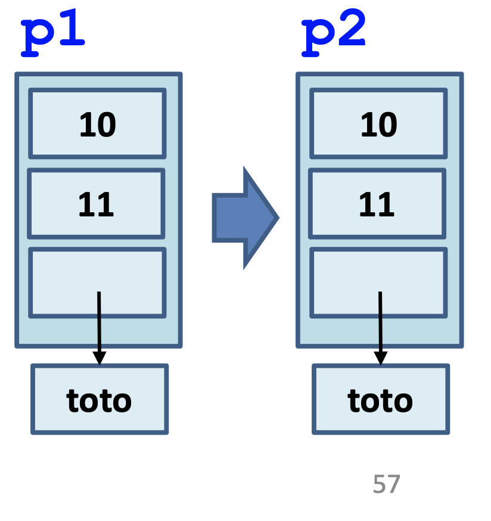

# Une classe en C++
## Code en C
```cpp
int amount;

void deposit(int x)
{
  amount += x;
}

int main()
{
  deposit(15);

  return 0;
}
```

## Code en C++
```cpp
// Bank est une classe
class Bank {
  // "Attribut"
  // ou "variable membre (de la classe)"
  int amount;

  // "Méthode"
  // ou "fonction membre (de la classe)"
  void deposit(int x)
  {
    this->amount += x;
  }
};

int main()
{
  // accountA et accountB sont des objets
  // appelés des instances de Bank
  Bank accountA;
  Bank accountB;

  accountA.deposit(15);

  return 0;
}
```

# Déclaration d'une classe
```cpp
class ClassName
{
  public:
    int methodA();
    float methodB();
  private:
    int attributeA;
}; // Attention il y'a un ";" 
```

# Encapsulation
Définit les droit d'accès aux membres de la classe
- Evolutivité
- Cohérence
- Sécurité

Un membre sans modificateur d'accès sera `private` par défaut

## Getter / Setter
En principe on ne modifie par un attribut directement on met en place deux méthode `public` et l'attribut sera en `private`
```cpp
class Human
{
  private:
    string name;

  public:
    string getName()
    { 
      return name;
    }

    string setName(string name)
    {
      this->name = name;
    }
};
```

## Les modificateurs d'accès

`public`  
Accessible de partout par tout le monde

`private`  
Accessible uniquement par la classe courant

`protected`  
Accessible par la classe courante et les classe héritante

# Définition des méthodes
## En ligne (header file)
- La définition est dans la déclaration de la classe
- Le mot-clé `inline` est implicite (macro)
- Pour des fonction courtes

**Human.h**
```cpp
class Human
{
  private:
    string name;

  public:
    // Méthode inline
    string getName()
    { 
      return name;
    }

    // Méthode inline
    string setName(string name)
    {
      this->name = name;
    }
};
```

## Séparé
- Prototype dans la déclaration de la classe
- Définition hors de la déclaration de la classe
- On utilise l'opérateur `::`

**Human.h**  
*Interface*
```cpp
class Human
{
  private:
    string name;

  public:
    // Méthode inline
    string getName()
    { 
      return name;
    }

    // Méthode inline
    string setName(string name)
    {
      this->name = name;
    }

    string say(string smt);
};
```


**Human.cpp**  
*Implémentation*
```cpp
#include "Human.h"

void Human::say(string smt)
{
  cout << smt;
  return smt;
}
```

# `#pragma once`
Permet d'inclure qu'une seule fois un fichier pour le compilateur

```cpp
#ifndef HUMAN_H
#define HUMAN_H

class Human
{
  private:
    string name;
};
#endif
```

devient:

```cpp
#pragma once

class Human
{
  private:
    string name;
};
```

# Instanciation d'un objet

```cpp
int main()
{
  Human clems = Human();
  clems.say("hello");
}
```

```cpp
int main()
{
  Human *clems = new Human();
  clems->say("hello");
  delete clems;
}
```

# Constructeur

```cpp
class Human
{
  private:
    string name;

  public:
    Human();
};

Human::Human()
{
  this->name = "no_name";
}
```

## Les plusieurs types de constructeurs
### Constructeur par défaut
Pas de paramètres  
`Human()`  

```cpp
class Human
{
  public:
    Human();
};

Human::Human()
{
  this->height = 170;
  this->name = "no_name";
}
```

```cpp
class Human
{
  public:
    Human(int height = 170, string name = "no name");
};

Human::Human(int height, string name)
{
  this->height = height;
  this->name = name;
}
```

### Constructeurs standard
Plusieurs paramètres de tous types  
`Human(T1, T2, ...)`  

```cpp
class Human
{
  public:
    Human(int height, string name);
};

Human::Human(int height, string name)
{
  this->height = height;
  this->name = name;
}
```

```cpp
class Human
{
  public:
    Human(int height = 170, string name = "no name");
};

Human::Human(int height, string name)
{
  this->height = height;
  this->name = name;
}
```

### Constructeur de conversion 
Un seul paramètre n'était pas du type de la classe   
`Human(T)`

```cpp
class Human
{
  public:
    Human(string name);
};

Human::Human(string name)
{
  this->name = name;
}
```

```cpp
int main()
{
  // Conversion explicite
  Human clems = Human("clems");
  Human dav("dav");

  //Conversion implicite
  Human jerem = "jerem";
}
```

#### Interdire la conversion implicite
On peut interdire la conversion implicite avec le mot-clé `explicit`
```cpp
class Human
{
  public:
    explicit Human(string name);
};
```

### Constructeur par recopie  
Un paramètre qui est une référence sur un objet de la classe    
`Human(Human&)`

Ce constructeur est souvent appelé implicitement:
- A l'initialisation d'un objet avec `=`  
  `Human clems = dav;`

- Au passage d'un objet en argument à une méthode  
  `fn(clems);`

- Lors d'un `return`  
  `return clems;`

De ce fait le compilateur fournie automatiquement un constructeur par copie (bit à bit) qui copie "en surface".  

Il n'est pas suffisant pour copier un objet en profondeur, par exemple s'il y'a un pointeur dans l'objet.

#### Par copie simple (existe implicitement)
```cpp
class Human
{
  private:
    string name;
    int height;

  public:
    Human(const Human& human);
};

Human::Human(const Human& human)
{
  this->name = human.name;
  this->height = human.height;
}
```


#### Par copie en profondeur
```cpp
class Human
{
  private:
    char *name;
    int height;

  public:
    Human(const Human& human);
};

Human::Human(const Human& human)
{
  this->height = human.height;
  this->name = new char[strlen(human.name) + 1];
  strcpy(this->name, human.name);
}
```



## Appels de constructeurs
```cpp
Human clems = Human("clems", 185);

Human clems("clems", 185);

Human clems = "clems";
// === Human clems = Human("clems")

Human *clems;
clems = new Human("clems", 185);

Human clems;

Human humans[10];
```

## Initialisation temporaires
```cpp
cout << Human("clems", 185).getName();
```

## Subtilité d'initialisation
```cpp
// Appel directement le constructeur standard
// sans passer par le constructeur par défaut
Human clems = Human("clems", 185);
```

Est différent de 

```cpp
Human clems; // Appel le constructeur par défaut
clems = Human("clems", 185);
```

Dans le 1er cas, il appel directement le constructeur standard.

Dans le 2ème cas, on appel en premier le constructeur par défaut, pour donner les valeurs par défaut à notre objet, puis le constructeur standard.

## Liste d'initialisation
```cpp
Human::Human(string name, int height) : name(name), height(height)
{
}
```

C'est indispensable pour initialiser:
- **Un attribut constant**
- **Un attribut de type référence**
- **Un attribut d'un type sans constructeur par défaut**

## Généralités
Un constructeur par défaut n'est plus disponible s'il le programmeur définit un constructeur standard

Si on constructeur a des valeurs par défaut pour ses paramètres, celles-ci doivent figurer dans la déclaration de la classe (`class.h`)

La déclaration d'un tableau d'objets génère autant d'appels au constructeur par défaut que d'éléments du tableau

*Bonne pratique:*  
Redéfinir le constructeur par défaut, et profiter pour donner des valeurs par défaut aux attributs

# Destructeur
- Appel implicite à la destruction d'un objet
- Un destructeur par défaut existe
- Pas de type de retour
- Pas de paramètre
- Un seul destructeur par classe
- `~className()` 

Il permet:
- Libérer les mémoire en détruisant les membres dynamique
- Fermer les flux (fichiers, etc...)
- Stopper les threads

```cpp
class Human
{
  private:
    char *name;

  public:
    ~Human();
};

Human::~Human()
{
  delete []name;
}
```

```cpp
int main()
{
  Human *clems = new Human;
  delete clems;

  Human *humans = new Human[10];
  delete []humans;
}
```

# Membres constant
Un attribut constant est initialisé à la construction  
Il n'est plus modifiable par la suite

```cpp
class Human
{
  private:
    const string name;
};


Human::Human(string name)
{
  // this->name = name;
  // Pas possible
}

Human::Human(string name) : name(name)
{
}
```

## Méthode `const`
Une méthode suffixé par `const` signifie qu'elle ne modifie pas l'objet courant  
Ca indique eur c'est une fonction de consultation d'objet (pas de modification)

```cpp
class Human
{
  private:
    string name;

  public:
    // Ne modifie pas l'objet, mais le consulte
    string getName() const;

    // Modifie l'objet, change le nom
    string setName(string name);
};
```

### Avec objet constant
```cpp
const Human clems;
clems.getName();
```

On peut uniquement appeler `clems.getName()` si c'est une méthode constante car l'objet est constant

Il n'est alors pas possible d'appeler `clems.setName("clems")` car il modifie un objet qui est constant

### Surcharge
On peut surcharger une méthode *non constante* par une méthod *constante* ayant la même entête

La méthode **non constante** sera appelée par les objets variables

La méthode **constant** sera appelée par les objets constants

```cpp
class Human
{
  private:
    string name;

  public:
    string getName() const
    {
      return this->name;
    }

    string& getName()
    {
      return this->name;
    }

    // ERREUR car getName() peut être assignée (Lvalue) et c'est une const
    // string& getName() const
    // {
    //   return this->name;
    // }
};
```

```cpp
int main()
{
  const Human clems;
  clems.getName();
  clems.getName() = "clems"; // ERREUR

  Human ven;
  ven.getName();
  ven.getName() = "ven"; // OK
}
```

# Le pointeur `this`
`this` contient l'adresse de l'objet courant

```cpp
class Human
{
  private:
    string name;

  public:
    string getName() const
    {
      return this->name;
    }
};
```

Le déréférencement de `this` donne l'objet lui-même
```cpp
return *this;
```

# Membres statique
Il y'a deux type de membres:

## Membres d'instances
Ce sont les membres que font l'on fait référence via une instance d'une classe
```cpp
clems.getName();
clems.height;
// ...
```

## Membres de classe (static)
Ce sont les membres que font l'on fait référence via la classe directement  
On a pas besoin d'instance de la classe

```cpp
class Human
{
  private:
    static int nbHuman = 0;

  public:
    Human()
    {
      // ...
      Human::nbHuman++;
    }

    static bool isHuman(const Human& clems)
    {
      // ...
    }

    static int getNbHuman()
    {
      return Human::nbHuman;
    }
};
```

```cpp
Human::isHuman(clems);
Human::nbHuman;
// ...
```

# Fonction et classes amies (`friend`)
Ce sont des fonctions ou classe pouvant accéder aux membres privés d'une classe

## Fonction amie
```cpp
class Human
{
  private:
    string name;

  public:
    friend string setName(Human &human, string name);
};

string setName(Human &human, string name)
{
  human.name = name;
  return name;
}
```

## Classe amie
```cpp
class Human
{
  friend class Monkey;

  private:
    string name = "clems";
};

class Monkey {
  public:
    string getHumanName() {
      Human clems;
      return clems.name;
    }
};
```

# Diagramme UML


## Membres privés
préfixés par `-`

## Membres publics
préfixés par `+`

## Membres static
Sont <u>soulignés</u>

## Méthodes `const`
suffixé par `query`

## Types
Les types des attributs, et méthodes sont indiqués  
Le type `void` est omis
